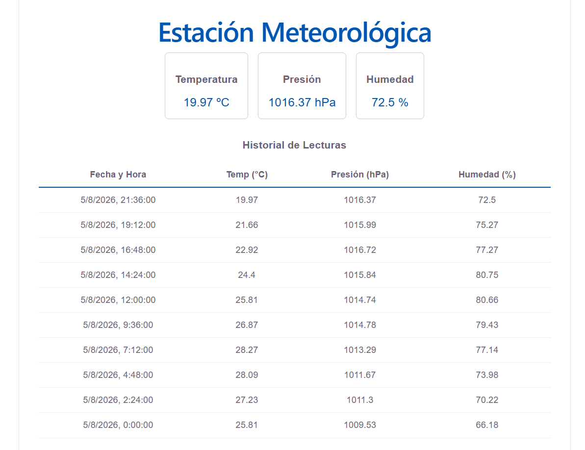

# Aplicación Dashboard Supabase



## Descripción

PanelTiempo es una aplicación React desarrollada con Vite que muestra datos meteorológicos obtenidos desde una tabla Supabase. El proyecto usa un dashboard principal para visualizar el registro más reciente y el historial de lecturas de temperatura, presión y humedad.

## Tecnologías

- React 19
- Vite
- React Router DOM
- Supabase REST API
- HTML/CSS

## Estructura del proyecto

- `src/api/supabase.js` — Lógica de petición REST a Supabase
- `src/components/WheatherCards.jsx` — Componente de tarjetas para los valores actuales
- `src/pages/Dashboard.jsx` — Página principal con estado y renderizado de datos
- `src/App.jsx` — Enrutamiento de la aplicación con `react-router-dom`
- `.env` — Variables de entorno para Supabase

## Características

- Obtiene datos desde Supabase usando `fetch` y `import.meta.env`
- Muestra la lectura más reciente en tarjetas de temperatura, presión y humedad
- Panel histórico con tabla de registros ordenada por fecha
- Soporte para futuras rutas mediante React Router

## Configuración

1. Clona el repositorio
2. Instala dependencias:
   ```bash
   npm install
   ```
3. Crea un archivo `.env` en la raíz si no existe y agrega:
   ```env
   VITE_SUPABASE_URL=https://<tu-proyecto>.supabase.co
   VITE_SUPABASE_ANON_KEY=<tu-anon-key>
   ```
4. Inicia la aplicación:
   ```bash
   npm run dev
   ```

## Scripts disponibles

- `npm run dev` — Inicia el servidor de desarrollo
- `npm run build` — Genera la versión de producción
- `npm run preview` — Previsualiza el build de producción

## Notas

- Si la app muestra datos vacíos, revisa que la tabla `datos_sensor` exista y contenga registros.
- Asegúrate de reiniciar el servidor de Vite cada vez que actualices `.env`.

## Captura de pantalla

La imagen de portada muestra la interfaz principal con el dashboard y las tarjetas de datos actuales.

